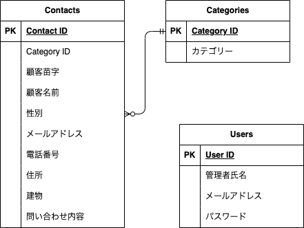

# アプリケーション名
試験 お問い合わせフォーム

## 環境構築

Dockerビルド

	1. git clone git@github.com:StrawberryFairyPrincess/exam_contact-form.git
	2. docker-compose up -d --build

Laravel環境構築

	1. docker-compose exec php bash
	2. composer install
	3. .env.exampleファイルをコピーして.envを作成し、環境変数をdocker-compose.ymlに合わせて変更する
	4. php artisan key:generate
	5. php artisan migrate
	6. php artisan db:seed

## 使用技術(実行環境)

	・Laravel Framework 8.83.8
	・PHP 7.4.9
	・MySQL 8.0.26
	・nginx 1.21.1
	・Fortify 1.9

## ER図

## URL

    ・開発環境：http://localhost/
    ・phpMyAdmin：http://localhost:8080/

## コミット場所

	・最終コミットしたブランチはfeature/loginです
	・未実装箇所
		・検索機能が反応しない
		・モーダルウィンドウのループ時のIDの変更が反映されない
		・CSVダウンロード時内容が何かのパスみたいなものになってしまう
